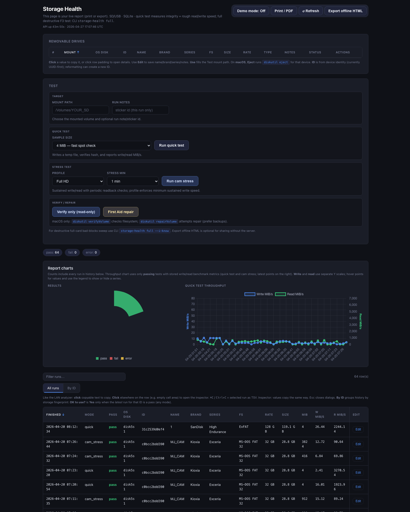

# Storage Health

## 🚀 Big Note

> Feature ideas are always welcome - feel free to open an issue or request.  
> I will do my best to improve this project, but updates depend on available time.  
> You are also welcome to build with your favorite AI tools and share improvements.

## Product Preview

Storage Health is a local dashboard for checking removable storage health, speed, and reliability.

How to use:
- Plug in your card/drive.
- Open the dashboard.
- Select mount path and run **Quick test** or **Cam stress**.
- Review charts and run history.

### Full page preview



**Storage Health** helps you check **any removable storage** that shows up as a USB/SD/external volume: **microSD/SD cards, USB sticks, portable SSDs**, etc. It runs **quick** (non-destructive) checks or a **full** destructive test with [F3](https://github.com/AltraMayor/f3), stores results in **SQLite** (`storage_health.db` by default; an existing `sd_health.db` in the same folder is renamed automatically once), mirrors to **JSONL** (`results.jsonl`), and can generate a static **HTML** report. The web UI uses the same **dark theme** as the Wi‑Fi &amp; LAN analyzer project.

**Why test before use:** Some bad or fake cards cause **cameras and dashcams to freeze, error, or fail to record**—not only slow transfers. A failing card can also trigger **I/O errors in the camera** when inserted. Run a **quick** or **full** test on a PC first; replace cards that fail or show wrong capacity.

CLI entry points: **`storage-health`** (primary) and **`sd-health`** (alias).

## Install

```bash
cd storage_health
python3 -m venv .venv
source .venv/bin/activate   # Windows: .venv\Scripts\activate
pip install -e .
```

Without installing, from the project root:

```bash
PYTHONPATH=. python3 -m sd_health --help
```

### Cross-platform format (camera-friendly)

Print **copy-paste** commands for **exFAT** or **FAT32** on **Windows, Linux, and macOS** (typical for cameras). Default is **print only**; automated erase is **macOS-only** via `diskutil`.

```bash
storage-health format --fs exfat --name CAMCARD
storage-health format --fs fat32 --example /dev/disk4 --name CAM
# macOS: actually erase whole disk (DESTROYS DATA — triple-check /dev/diskN):
storage-health format --device /dev/disk4 --fs exfat --name CAM --execute --i-know
```

### F3 (required for `storage-health full`)

F3 provides `f3write` and `f3read` on your `PATH`.

| OS | Install |
|----|---------|
| macOS | `brew install f3` |
| Linux | Package name often `f3`, `f3- fight-flash-fraud`, or build from source — see [F3 README](https://github.com/AltraMayor/f3) |
| Windows | Download a release build from the F3 project and add the folder to `PATH` |

## Safety

- **Full test (`storage-health full`)** fills the card with test files and verifies them. **All data on that volume can be lost.** Unmount backups; use `--i-know` only after you are sure the mount point is the correct removable card.
- **Quick raw read (`storage-health quick --raw-read`)** reads the entire block device. It does not intentionally overwrite user data, but it is I/O intensive and mistakes can target the wrong drive. Always use `--i-know` and double-check `--device`.
- The tool applies **heuristics** to refuse obvious system volumes (e.g. macOS `disk0`, Windows `C:`). This is not foolproof — **you** must pick the right device/mount.

## Usage

List removable candidates (heuristic; varies by OS):

```bash
storage-health list
```

**Quick test** — write/read a temporary file on a **mounted** volume (does not fill the card):

```bash
storage-health quick --mount /Volumes/MYCARD --notes "sticker A-12"
```

**Quick test** — optional **full-device read** to null (non-destructive, can take hours):

```bash
storage-health quick --raw-read --device /dev/rdisk3 --i-know --notes "reader slot 1"
```

On Windows use something like `--device \\.\PhysicalDrive2`.

**Full F3 test** — destructive; card should be mounted and empty/backup not needed:

```bash
storage-health full --mount /Volumes/MYCARD --i-know --notes "batch 2"
```

Optional `--device` adds identity metadata; `--timeout` sets per-phase seconds (default very large).

**Report**:

```bash
storage-health report --jsonl ./results.jsonl --out report.html
open report.html
```

Defaults: `--jsonl` defaults to `./results.jsonl` in the current working directory.

### Web dashboard (local)

Runs **FastAPI + uvicorn** on **localhost** (default `127.0.0.1:5003`). The UI reads/writes **`storage_health.db`** (same pattern as the network analyzer’s `history.db`). Open the URL in a browser to view runs, run a **quick** test from the form, and rebuild `report.html`.

```bash
cd storage_health   # cwd sets default paths for ./storage_health.db and ./results.jsonl
storage-health serve
# Open http://127.0.0.1:5003/
```

Options: `--host`, `--port` / `-p`, `--jsonl`, `--report`, `--db`.

#### Auto-start the server (Cursor / VS Code)

This repo includes [`.vscode/tasks.json`](.vscode/tasks.json): the task **“Storage Health: serve (auto)”** is set to **`runOn: folderOpen`**, so when you open this workspace the dashboard server starts in the background (if `.venv` exists and the app is installed).

1. First time, Cursor/VS Code may ask to **allow automatic tasks** for this folder — choose **Allow**.
2. [`.vscode/settings.json`](.vscode/settings.json) sets `"task.allowAutomaticTasks": "on"` so the prompt is minimized after you trust the folder.

Manual run: **Tasks → Run Task → Storage Health: serve (manual)** or:

```bash
./scripts/serve.sh
```

Override port: `STORAGE_HEALTH_PORT=8877 ./scripts/serve.sh`

#### Optional: start at macOS login

After `pip install -e .` and a working `.venv`:

```bash
bash scripts/install-macos-login-agent.sh
```

That installs a **LaunchAgent** so `storage-health serve` runs when you log in. Unload/reload instructions are printed by the script. Do **not** use both login agent and folder-open task if they share the same port (pick one).

**Security:** the API is intended for **local use only**. Do not expose `--host 0.0.0.0` on untrusted networks. Destructive **full** F3 tests are **not** exposed in the web UI — use `storage-health full` from the CLI.

## Troubleshooting: “terminal cwd does not exist”

This usually means the editor is trying to open a terminal in a path that was renamed or no longer exists, or a bad custom cwd was combined with `${workspaceFolder}`.

Fix:

- Open the actual project folder for this repo (or use `Storage Health.code-workspace`).
- Set `terminal.integrated.cwd` to `${workspaceFolder}`.
- Set `terminal.integrated.splitCwd` to `workspaceRoot`.
- Avoid mixed values like `${workspaceFolder}/~/...`.

## Data format

**Primary store:** SQLite table `runs` in `storage_health.db` (override with `--db`). **Mirror:** one JSON object per line in `results.jsonl` when you use the CLI or web UI. Fields include `run_id`, timestamps, `test_mode` (`quick` | `full`), `device_path`, `mount_point`, `identity`, `result` (`pass` | `fail` | `error`), `summary`, optional `error_detail`, and `operator_notes`. Existing JSONL-only history is imported into the DB automatically the first time you generate a report or start the server.

## License

This project is provided as-is for operational use; F3 is GPLv3 — comply with F3’s license when distributing binaries.
